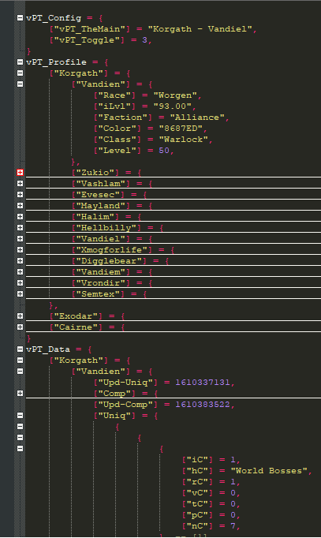

# Progress Tracker
'Progress Tracker' is a World of Warcraft addon designed make your life easier in extracting Uniq/Comp Values from ALL THE THINGS.

## Need Help On:
Attempting to convert Lua (table) to JSON, CSV, Excel and/or Google Sheet from the data stored from the addon.

## Contribute
Please report bugs on the [Github Issue Reporting] https://github.com/vandiel01/ProgressTracker/issues/new.

The use of [BugGrabber] https://www.curseforge.com/wow/addons/bug-grabber and [BugSack] https://www.curseforge.com/wow/addons/bugsack will help tremendously with the debugging process.

You can also contribute to the addon by [Donate] https://paypal.me/Vandiel01

## Image Samples
 